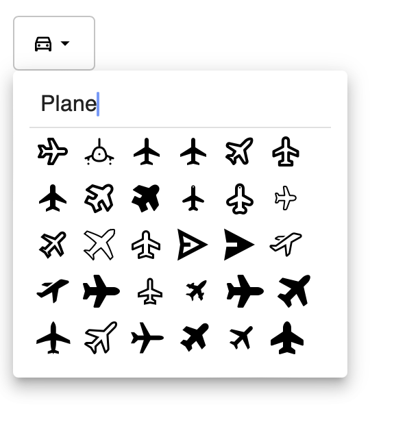

# @zunicornshift/mui-iconify-picker

<p align="center">
	<a href="https://github.com/zUnicornShift/mui-iconify-picker">
			
	</a>
</p>

180,000+ icons in one icon picker by the support of Iconify.

This React component is allowing users to search Iconify icons and select. And this component
is using Material UI components internally.

## Installation

The `react`, `react-dom` and `@mui/material` are peer dependencies of this package. It means
you have to install them all in your project before installing this module.

```
"@mui/material": "^5.0.0 || ^6.0.0"
"react": "^17.0.0 || ^18.0.0"
"react-dom": "^17.0.0 || ^18.0.0"
```

Then run the below commands based on your package manager.

```
npm install --save @zunicornshift/mui-iconify-picker #NPM
yarn add @zunicornshift/mui-iconify-picker           #Yarn
```

## Usage

```
import IconifyPicker from "@zunicornshift/mui-iconify-picker";


<IconifyPicker />
```

All the props are optional, you can install it and use it
without any customizations.

## Customizations

|     Prop Name     | Type                                                  | Description                      |
| ----------------- | ----------------------------------------------------- | -------------------------------- |
| `value`           | `string \| null`                                       | The name of the selected icon. Icon names must be in `"mdi:airplane"` format. |
| `onChange`        | `(value: string, e: MouseEvent<HTMLElement>) => void` | A callback function that receiving value as the first parameter and the original event as the second parameter. |
| `placeholderText` | `string`                                              | The placeholder text that displaying in search box |
| `variant`         | `"standard"\|"filled"\|"outlined"`                      | The variant of the outer input field |
| `apiBaseUrl`      | `string \| URL`                                        | The base URL of the Iconify API. You can use a backup host or a self hosted URL. The default value is `https://api.iconify.design`. Please [support iconfiy](https://iconify.design/sponsors/). |
| `initIcons`       | `string[]`                                            | Icon list to display when opening the icon selector popup. |
| `prefixes`        | `string`                                              | Filter the icon results. Comma separated list of icon set prefixes. You can use partial prefixes that end with "-", such as "mdi-" matches "mdi-light". |
| `prefix`          | `string`                                              | Filter the icon results.  Icon set prefix if you want to get result only for one icon set. |
| `category`        | `string`                                              | Filter the icon results. Limit search to icon sets from specific category. |
| `limit`           | `number`                                              | The number of icons receiving in one API call. |
| `inputProps`      | `OutlinedInputProps \| FilledInputProps \| InputProps`  | Control the outer wrapper. |
| `popoverProps`    | `PopoverProps`                                        | Control the popover component. |
| `slots.loading`   | `React.ComponentType`                                 | A react component to display when items loading |
| `slots.error`     | `React.ComponentType`                                 | A react component to display when an error occurred when searching |

All the props are optional.

